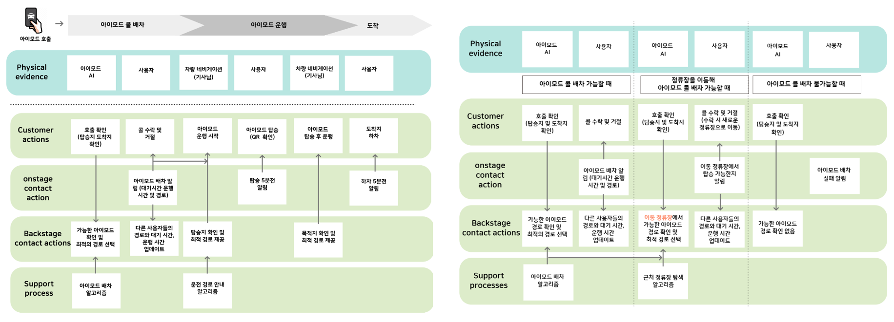

## 인천광역시의 수요응답형 버스 아이모드 최적화 방안 
---
제 8회 인천광역시 공공데이터 활용 창업 분석 경진대회 결과물로, 인천광역시의 수요응답형 버스 아이모드 최적화 방안 프로젝트입니다.

### 프로젝트 설명
---
인천 스마트시티 챌린지 사업의 일환으로 '아이모드(i-MoD, Incheon Mobility on Demand) 버스'를 2020년 10월부터 시범 운영 하고 있습니다. 그러나 아이모드를 실제 이용해본 승객들의 반응은 부정적입니다. 호출을 해도 배차가 되지 않거나 다른 승객을 태우기 위해 경로를 우회하며 이동 시간이 예상보다 늘어났기 때문입니다. 따라서 본 기획은 **인천시 지리 및 교통 공공 데이터를 이용해 지역 특성을 고려한 수요응답형 버스 최적화 방안**을 제안하고자 합니다. 데이터 분석을 통한 사용자의 수요와 실제 공급량을 파악하고 지리적 특성을 바탕으로 아아모드 최적화 알고리즘을 제안했습니다. 또한 사용자의 편의 증진을 위한 UX 개선 아이디어를 제안했습니다.

### 데이터셋
---
| 데이터 보유 기관 | 활용 데이터 |
| --- | --- |
| 인천광역시 | 인천광역시_시내버스 정류소 현황 |
| 인천광역시 | 인천광역시_정류장별 이용승객 현황 |
| 인천광역시 | 인천광역시_인천광역시 시내버스 노선 현황 |
| 인천광역시 | 인천광역시_산업별 사업체 및 종사자수 현황  |
| 인천광역시 | 인천광역시_읍면동별 세대 및 인구 현황 |

### 기술스택
---
python

### 데이터 분석 내용
---
#### 시스템 운영
시내버스 정류소 현황 데이터를 분석하여 아이모드의 정류장을 파악했습니다.

#### 최적화 알고리즘
정류장별 이용 승객현황, 시내버스 노선 데이터를 분석하여 정류장 별 이용 수요을 분석했습니다. 이를 바탕으로 수요가 많은 정류장에 가중치를 부여하는 알고리즘과 준다이나믹 노선을 제안했습니다. 또한 승객의 편의를 위해 출발지 추천 알고리즘 및 실시간 노선 공개 아이디어를 추가하였습니다.

#### 유동인구 및 개선방향 설계
시내버스 노선 현황, 산업별 사업체 수 및 종사자 현황, 읍면동별 세대 및 인구 현황 데이터를 분석하여 유동인구를 파악하고 현재 교통 상황 및 취약 지점을 파악하였습니다.

### 시스템 작동 방식
---
  

### 수행 결과
---
데이터 분석을 통해 아이모드의 문제점을 파악하고 지역 특성과 수요를 고려한 효과적인 개선안을 제공했습니다. 또한 데이터 기반 교통 복지를 실현하는데 기여했습니다. 

### 수행 성과
---
- 제 8회 인천광역시 공공데이터 활용 창업 분석 경진대회 장려상 수상
